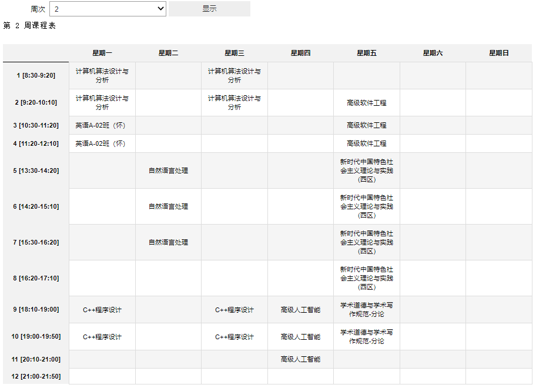
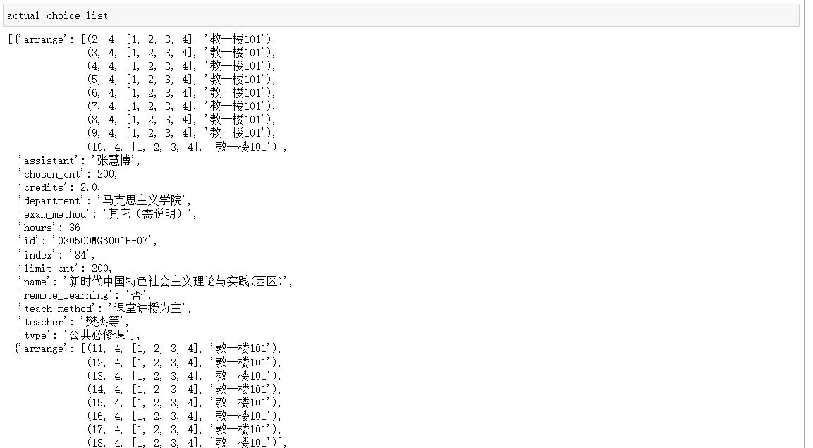
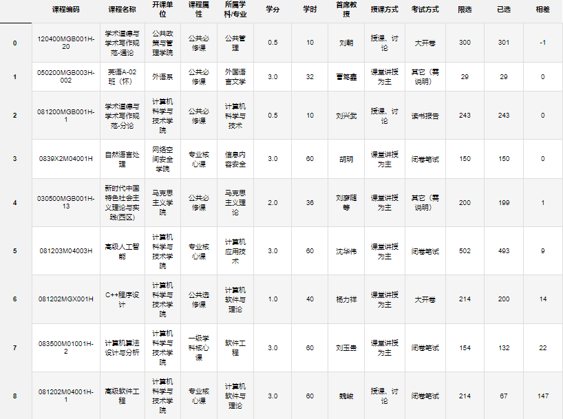
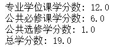
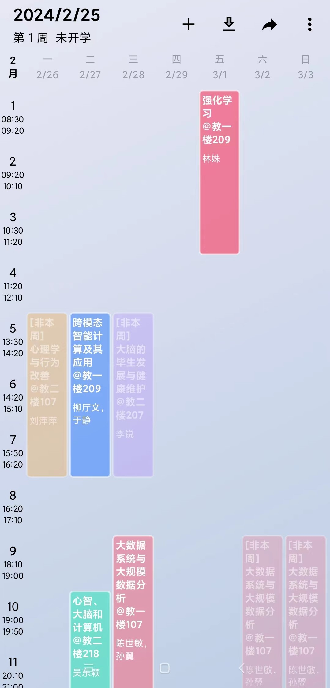
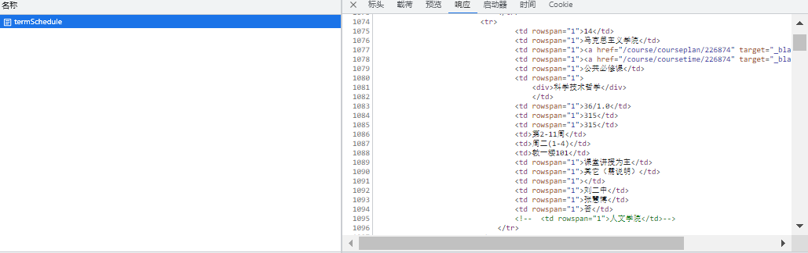
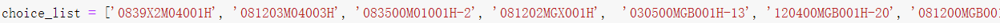

- [国科大选课分析](#国科大选课分析)
  - [功能展示](#功能展示)
  - [使用方法](#使用方法)
  - [数据结构](#数据结构)


# 国科大选课分析

国科大一些热门课很快会被抢完，为了方便抢课，选课系统未开放前，可以预先确定要选择的课程编码。本脚本方便对预选择的课程进行分析，包括检查预选择的课程是否存在时间冲突、预览课程表、快速确定与已选课程时间不冲突的公共必修课班级、统计学分信息、根据以往选课限选和已选之间的差额排出选课顺序，生成选课单。

支持根据课程编码生成WakeUp课表导入文件。

## 功能展示

1. 自动检测课程冲突

   

 2. 预生成选课课程表，方便判断课程分布是否合理

    

3. 对于班级较多的公共必修课（新时代中国特色社会主义理论与实践、学术道德与学术写作规范-通论），筛选出与已选专业课和公共选修课不冲突的班级

   

4. 根据限选和已选之间的差额，排出抢课顺序，生成选课单

   

5. 统计学分信息

   

6. 生成WakeUp导入文件
   
   

7. 更多自定义功能...

## 使用方法

1. 将课程页面html保存放到项目目录

   

2. 替换index.ipynb中的预选课程编码

   

3. 执行index.ipynb即可进行冲突检测、课程表预览、选课表生成、学分统计
   
4. 生成WakeUp导入文件
   
   ```python
   python generate_csv.py <html路径> --choice_list <选课课程编码列表，用空格分隔>
   ```

## 数据结构

本脚本核心功能是从网页中提取出课程信息，方便后续选课分析。

所有课程信息存入results列表中，其中每一门课程信息包括以下字段：

| 字段            | 含义                                                    |
| --------------- | ------------------------------------------------------- |
| index           | 序号                                                    |
| department      | 开课单位                                                |
| id              | 课程编码                                                |
| name            | 课程名称                                                |
| type            | 课程属性                                                |
| discipline      | 所属学科/专业                                           |
| hours           | 课时                                                    |
| credits         | 学分                                                    |
| limit_cnt       | 限选                                                    |
| chosen_cnt      | 已选                                                    |
| arrange         | 排课安排，结构为：[(周次，星期，[节次列表]，教室)，...] |
| teach_method    | 授课方式                                                |
| exam_method     | 考试方式                                                |
| chair_professor | 首席教授                                                |
| teacher         | 主讲教授                                                |
| assistant       | 助教                                                    |
| remote_learning | 是否远程教学                                            |

